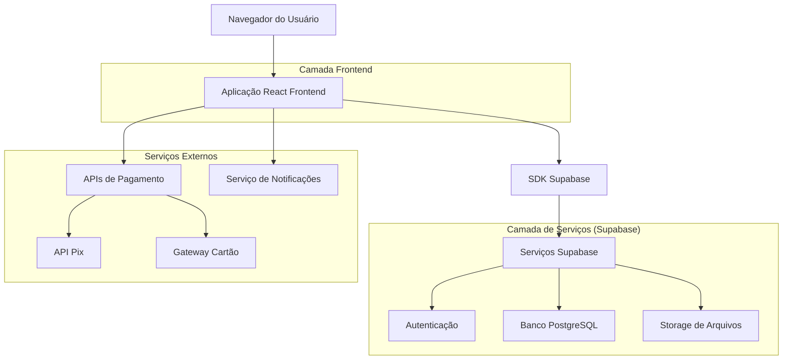
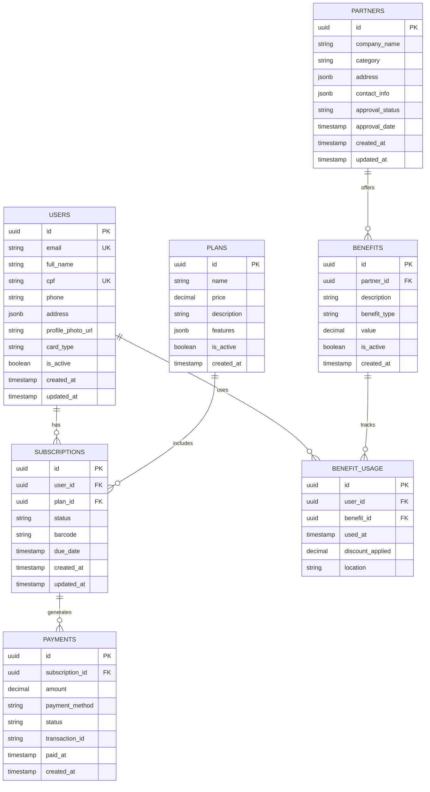

# Documento de Arquitetura Técnica - TrinCard

## 1. Design da Arquitetura



## 2. Descrição das Tecnologias

* Frontend: React\@18 + TypeScript + TailwindCSS\@3 + Vite + React Router

* Backend: Supabase (PostgreSQL + Auth + Storage + Real-time)

* Pagamentos: Stripe para cartão de crédito + API Pix (Mercado Pago/PagSeguro)

* Notificações: Firebase Cloud Messaging para push + Supabase para e-mail

* Geração de Códigos: bibliotecas JsBarcode para código de barras + QRCode.js

## 3. Definições de Rotas

| Rota              | Propósito                                           |
| ----------------- | --------------------------------------------------- |
| /                 | Página inicial com apresentação do produto e planos |
| /cadastro         | Página de registro de novos usuários                |
| /login            | Página de autenticação de usuários                  |
| /assinatura       | Seleção de planos e processamento de pagamentos     |
| /dashboard        | Área principal do assinante com cartão digital      |
| /parceiros        | Lista pública de estabelecimentos parceiros         |
| /historico        | Histórico de uso de benefícios do assinante         |
| /faturas          | Download de faturas e comprovantes                  |
| /admin            | Dashboard administrativo (acesso restrito)          |
| /admin/assinantes | Gestão de usuários assinantes                       |
| /admin/parceiros  | Cadastro e aprovação de parceiros                   |
| /admin/relatorios | Relatórios e métricas do sistema                    |
| /perfil           | Configurações e dados pessoais do usuário           |

## 4. Definições de API

### 4.1 APIs Principais

**Autenticação de usuários**

```
POST /auth/signup
```

Request:

| Nome do Parâmetro | Tipo   | Obrigatório | Descrição                   |
| ----------------- | ------ | ----------- | --------------------------- |
| email             | string | true        | E-mail do usuário           |
| password          | string | true        | Senha (mínimo 8 caracteres) |
| full\_name        | string | true        | Nome completo               |
| cpf               | string | true        | CPF do usuário              |
| phone             | string | true        | Telefone de contato         |
| address           | object | true        | Endereço completo           |
| card\_type        | string | true        | "digital" ou "physical"     |

Response:

| Nome do Parâmetro | Tipo   | Descrição               |
| ----------------- | ------ | ----------------------- |
| user              | object | Dados do usuário criado |
| session           | object | Token de sessão         |

**Gestão de assinaturas**

```
POST /api/subscriptions
```

Request:

| Nome do Parâmetro | Tipo   | Obrigatório | Descrição                      |
| ----------------- | ------ | ----------- | ------------------------------ |
| user\_id          | uuid   | true        | ID do usuário                  |
| plan\_id          | uuid   | true        | ID do plano selecionado        |
| payment\_method   | string | true        | "pix" ou "credit\_card"        |
| payment\_data     | object | true        | Dados específicos do pagamento |

Response:

| Nome do Parâmetro | Tipo      | Descrição                      |
| ----------------- | --------- | ------------------------------ |
| subscription\_id  | uuid      | ID da assinatura criada        |
| barcode           | string    | Código de barras personalizado |
| due\_date         | timestamp | Data de vencimento             |
| status            | string    | Status da assinatura           |

**Gestão de parceiros**

```
POST /api/partners
```

Request:

| Nome do Parâmetro | Tipo   | Obrigatório | Descrição                      |
| ----------------- | ------ | ----------- | ------------------------------ |
| company\_name     | string | true        | Nome da empresa                |
| category          | string | true        | Categoria do estabelecimento   |
| address           | object | true        | Endereço completo              |
| contact\_info     | object | true        | Telefone e e-mail              |
| benefits          | array  | true        | Lista de benefícios oferecidos |
| documents         | array  | false       | Documentos para aprovação      |

Response:

| Nome do Parâmetro | Tipo      | Descrição                        |
| ----------------- | --------- | -------------------------------- |
| partner\_id       | uuid      | ID do parceiro criado            |
| status            | string    | Status de aprovação              |
| approval\_date    | timestamp | Data de aprovação (se aplicável) |

Exemplo de Request:

```json
{
  "company_name": "Academia FitLife",
  "category": "academia",
  "address": {
    "street": "Rua das Flores, 123",
    "city": "São Paulo",
    "state": "SP",
    "zip_code": "01234-567"
  },
  "contact_info": {
    "phone": "(11) 99999-9999",
    "email": "contato@fitlife.com"
  },
  "benefits": [
    {
      "description": "20% de desconto na mensalidade",
      "type": "percentage",
      "value": 20
    }
  ]
}
```

## 5. Modelo de Dados

### 5.1 Definição do Modelo de Dados



### 5.2 Linguagem de Definição de Dados

**Tabela de Usuários (users)**

```sql
-- Criar tabela
CREATE TABLE users (
    id UUID PRIMARY KEY DEFAULT gen_random_uuid(),
    email VARCHAR(255) UNIQUE NOT NULL,
    full_name VARCHAR(255) NOT NULL,
    cpf VARCHAR(14) UNIQUE NOT NULL,
    phone VARCHAR(20) NOT NULL,
    address JSONB NOT NULL,
    profile_photo_url TEXT,
    card_type VARCHAR(10) CHECK (card_type IN ('digital', 'physical')) DEFAULT 'digital',
    is_active BOOLEAN DEFAULT true,
    created_at TIMESTAMP WITH TIME ZONE DEFAULT NOW(),
    updated_at TIMESTAMP WITH TIME ZONE DEFAULT NOW()
);

-- Criar índices
CREATE INDEX idx_users_email ON users(email);
CREATE INDEX idx_users_cpf ON users(cpf);
CREATE INDEX idx_users_created_at ON users(created_at DESC);

-- Permissões Supabase
GRANT SELECT ON users TO anon;
GRANT ALL PRIVILEGES ON users TO authenticated;
```

**Tabela de Assinaturas (subscriptions)**

```sql
-- Criar tabela
CREATE TABLE subscriptions (
    id UUID PRIMARY KEY DEFAULT gen_random_uuid(),
    user_id UUID REFERENCES users(id) ON DELETE CASCADE,
    plan_id UUID REFERENCES plans(id),
    status VARCHAR(20) CHECK (status IN ('active', 'inactive', 'suspended', 'cancelled')) DEFAULT 'active',
    barcode VARCHAR(255) UNIQUE NOT NULL,
    due_date TIMESTAMP WITH TIME ZONE NOT NULL,
    created_at TIMESTAMP WITH TIME ZONE DEFAULT NOW(),
    updated_at TIMESTAMP WITH TIME ZONE DEFAULT NOW()
);

-- Criar índices
CREATE INDEX idx_subscriptions_user_id ON subscriptions(user_id);
CREATE INDEX idx_subscriptions_status ON subscriptions(status);
CREATE INDEX idx_subscriptions_due_date ON subscriptions(due_date);

-- Permissões Supabase
GRANT SELECT ON subscriptions TO anon;
GRANT ALL PRIVILEGES ON subscriptions TO authenticated;
```

**Tabela de Planos (plans)**

```sql
-- Criar tabela
CREATE TABLE plans (
    id UUID PRIMARY KEY DEFAULT gen_random_uuid(),
    name VARCHAR(100) NOT NULL,
    price DECIMAL(10,2) NOT NULL,
    description TEXT,
    features JSONB,
    is_active BOOLEAN DEFAULT true,
    created_at TIMESTAMP WITH TIME ZONE DEFAULT NOW()
);

-- Dados iniciais
INSERT INTO plans (name, price, description, features) VALUES
('TrinCard Básico', 29.90, 'Plano básico com benefícios essenciais', '{"max_benefits": 10, "physical_card": false}'),
('TrinCard Premium', 49.90, 'Plano premium com todos os benefícios', '{"max_benefits": -1, "physical_card": true, "priority_support": true}');

-- Permissões Supabase
GRANT SELECT ON plans TO anon;
GRANT ALL PRIVILEGES ON plans TO authenticated;
```

**Tabela de Parceiros (partners)**

```sql
-- Criar tabela
CREATE TABLE partners (
    id UUID PRIMARY KEY DEFAULT gen_random_uuid(),
    company_name VARCHAR(255) NOT NULL,
    category VARCHAR(50) NOT NULL,
    address JSONB NOT NULL,
    contact_info JSONB NOT NULL,
    approval_status VARCHAR(30) CHECK (approval_status IN ('approved', 'pending_documentation', 'rejected')) DEFAULT 'pending_documentation',
    approval_date TIMESTAMP WITH TIME ZONE,
    created_at TIMESTAMP WITH TIME ZONE DEFAULT NOW(),
    updated_at TIMESTAMP WITH TIME ZONE DEFAULT NOW()
);

-- Criar índices
CREATE INDEX idx_partners_category ON partners(category);
CREATE INDEX idx_partners_approval_status ON partners(approval_status);
CREATE INDEX idx_partners_created_at ON partners(created_at DESC);

-- Permissões Supabase
GRANT SELECT ON partners TO anon;
GRANT ALL PRIVILEGES ON partners TO authenticated;
```

**Tabela de Benefícios (benefits)**

```sql
-- Criar tabela
CREATE TABLE benefits (
    id UUID PRIMARY KEY DEFAULT gen_random_uuid(),
    partner_id UUID REFERENCES partners(id) ON DELETE CASCADE,
    description TEXT NOT NULL,
    benefit_type VARCHAR(20) CHECK (benefit_type IN ('percentage', 'fixed_amount', 'free_service')) NOT NULL,
    value DECIMAL(10,2),
    is_active BOOLEAN DEFAULT true,
    created_at TIMESTAMP WITH TIME ZONE DEFAULT NOW()
);

-- Criar índices
CREATE INDEX idx_benefits_partner_id ON benefits(partner_id);
CREATE INDEX idx_benefits_is_active ON benefits(is_active);

-- Permissões Supabase
GRANT SELECT ON benefits TO anon;
GRANT ALL PRIVILEGES ON benefits TO authenticated;
```

**Tabela de Uso de Benefícios (benefit\_usage)**

```sql
-- Criar tabela
CREATE TABLE benefit_usage (
    id UUID PRIMARY KEY DEFAULT gen_random_uuid(),
    user_id UUID REFERENCES users(id) ON DELETE CASCADE,
    benefit_id UUID REFERENCES benefits(id),
    used_at TIMESTAMP WITH TIME ZONE DEFAULT NOW(),
    discount_applied DECIMAL(10,2),
    location TEXT
);

-- Criar índices
CREATE INDEX idx_benefit_usage_user_id ON benefit_usage(user_id);
CREATE INDEX idx_benefit_usage_used_at ON benefit_usage(used_at DESC);

-- Permissões Supabase
GRANT SELECT ON benefit_usage TO anon;
GRANT ALL PRIVILEGES ON benefit_usage TO authenticated;
```

**Tabela de Pagamentos (payments)**

```sql
-- Criar tabela
CREATE TABLE payments (
    id UUID PRIMARY KEY DEFAULT gen_random_uuid(),
    subscription_id UUID REFERENCES subscriptions(id) ON DELETE CASCADE,
    amount DECIMAL(10,2) NOT NULL,
    payment_method VARCHAR(20) CHECK (payment_method IN ('pix', 'credit_card')) NOT NULL,
    status VARCHAR(20) CHECK (status IN ('pending', 'paid', 'failed', 'refunded')) DEFAULT 'pending',
    transaction_id VARCHAR(255),
    paid_at TIMESTAMP WITH TIME ZONE,
    created_at TIMESTAMP WITH TIME ZONE DEFAULT NOW()
);

-- Criar índices
CREATE INDEX idx_payments_subscription_id ON payments(subscription_id);
CREATE INDEX idx_payments_status ON payments(status);
CREATE INDEX idx_payments_created_at ON payments(created_at DESC);

-- Permissões Supabase
GRANT SELECT ON payments TO anon;
GRANT ALL PRIVILEGES ON payments TO authenticated;
```

