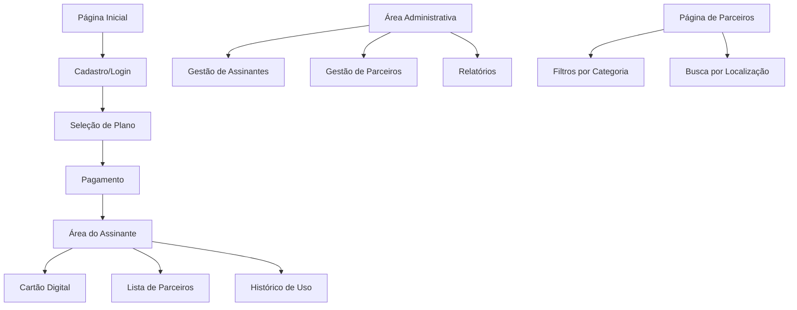

# Documento de Requisitos do Produto - TrinCard

## 1. Visão Geral do Produto
O TrinCard é um cartão de benefícios por assinatura voltado ao público esportivo, oferecendo descontos e vantagens em hospitais, farmácias, academias, lojas esportivas e outros estabelecimentos parceiros.

O sistema resolve a necessidade de acesso facilitado a benefícios de saúde e bem-estar para praticantes de esportes, proporcionando economia e conveniência através de um cartão digital ou físico.

O produto visa capturar o mercado crescente de wellness e fitness, oferecendo uma solução integrada de benefícios com foco no público esportivo.

## 2. Funcionalidades Principais

### 2.1 Papéis de Usuário

| Papel | Método de Cadastro | Permissões Principais |
|-------|-------------------|----------------------|
| Assinante | Cadastro por e-mail com dados pessoais | Acesso ao cartão digital, benefícios, histórico de uso |
| Administrador | Acesso direto do sistema | Gerenciar assinantes, parceiros, planos e relatórios |
| Parceiro | Cadastro com aprovação administrativa | Visualizar benefícios oferecidos e status de aprovação |

### 2.2 Módulos de Funcionalidades

Nosso sistema TrinCard consiste nas seguintes páginas principais:

1. **Página Inicial**: seção hero com apresentação do produto, navegação principal, planos disponíveis e call-to-action para assinatura.
2. **Cadastro/Login**: formulário de registro com dados pessoais completos, autenticação segura e opção de dois fatores.
3. **Área do Assinante**: cartão digital personalizado, código de barras da assinatura, lista de parceiros com filtros, histórico de benefícios utilizados.
4. **Assinatura e Pagamentos**: seleção de planos, processamento de pagamentos via Pix e cartão, geração de código de barras personalizado.
5. **Área Administrativa**: dashboard de gestão, cadastro e aprovação de parceiros, gerenciamento de assinantes, relatórios e notificações.
6. **Página de Parceiros**: listagem pública de estabelecimentos parceiros com filtros por categoria e localização.

### 2.3 Detalhes das Páginas

| Nome da Página | Nome do Módulo | Descrição da Funcionalidade |
|----------------|----------------|-----------------------------|
| Página Inicial | Seção Hero | Apresentar o TrinCard com design esportivo, destacar benefícios principais e botão de assinatura |
| Página Inicial | Planos e Preços | Exibir opções de assinatura mensal com valores, benefícios inclusos e comparação entre planos |
| Cadastro/Login | Formulário de Registro | Coletar dados pessoais (nome, CPF, telefone, e-mail, endereço, foto), escolha entre cartão físico/digital |
| Cadastro/Login | Autenticação | Login seguro com e-mail/senha, opção de autenticação de dois fatores, recuperação de senha |
| Área do Assinante | Cartão Digital | Exibir cartão TrinCard personalizado com nome, validade, design esportivo e QR code |
| Área do Assinante | Código de Barras | Apresentar código de barras da assinatura com data/hora de geração e vencimento da próxima cobrança |
| Área do Assinante | Lista de Parceiros | Mostrar estabelecimentos parceiros com filtros por categoria (farmácia, academia, etc.) e localização |
| Área do Assinante | Histórico de Uso | Registrar e exibir histórico de benefícios utilizados com data, local e desconto aplicado |
| Área do Assinante | Faturas e Comprovantes | Disponibilizar download de faturas mensais e comprovantes de pagamento |
| Assinatura e Pagamentos | Seleção de Planos | Escolher plano mensal, visualizar benefícios inclusos e proceder para pagamento |
| Assinatura e Pagamentos | Processamento de Pagamento | Integrar Pix e cartão de crédito, gerar código de barras personalizado, configurar renovação automática |
| Assinatura e Pagamentos | Notificações de Cobrança | Enviar lembretes de vencimento por e-mail e push, processar renovação automática |
| Área Administrativa | Dashboard de Gestão | Exibir métricas de assinantes ativos, receita mensal, parceiros aprovados e pendências |
| Área Administrativa | Gestão de Assinantes | Criar, editar, bloquear e excluir assinantes, visualizar histórico de pagamentos |
| Área Administrativa | Gestão de Parceiros | Cadastrar estabelecimentos, gerenciar documentação, aprovar/rejeitar parceiros, enviar notificações |
| Área Administrativa | Relatórios | Gerar relatórios de vendas, assinaturas ativas, parceiros por status e performance |
| Página de Parceiros | Listagem Pública | Mostrar parceiros aprovados com informações de contato, benefícios oferecidos e localização |
| Página de Parceiros | Filtros e Busca | Filtrar por categoria, localização e tipo de benefício, busca por nome do estabelecimento |

## 3. Processo Principal

**Fluxo do Assinante:**
O usuário acessa a página inicial, visualiza os planos disponíveis e clica em "Assinar". É direcionado para o cadastro onde preenche dados pessoais e escolhe entre cartão físico ou digital. Após o cadastro, seleciona o plano desejado e realiza o pagamento via Pix ou cartão de crédito. O sistema gera automaticamente o código de barras personalizado e ativa a assinatura. O assinante acessa sua área pessoal onde visualiza o cartão digital, explora parceiros disponíveis e acompanha seu histórico de uso.

**Fluxo Administrativo:**
O administrador acessa o painel de gestão e visualiza o dashboard com métricas principais. Para cadastrar novos parceiros, preenche informações do estabelecimento, categoria e benefícios oferecidos. O parceiro envia documentação necessária que é analisada pelo admin. O status é atualizado para "Aprovado", "Aguardando Documentação" ou "Rejeitado", com notificações automáticas enviadas ao parceiro sobre mudanças de status.

## 4. Design da Interface do Usuário

### 4.1 Estilo de Design

- **Cores Primárias e Secundárias**: Verde vibrante (#00C851) como cor principal, azul esportivo (#007BFF) como secundária, cinza moderno (#6C757D) para textos
- **Estilo de Botões**: Botões arredondados com efeito hover, gradientes sutis e sombras suaves para profundidade
- **Fonte e Tamanhos**: Roboto como fonte principal, tamanhos 16px para texto corpo, 24px para títulos, 32px para headers
- **Estilo de Layout**: Design baseado em cards com bordas arredondadas, navegação superior fixa, sidebar responsiva para admin
- **Ícones e Emojis**: Ícones de esportes (🏃‍♂️, 🏋️‍♀️, ⚽), símbolos de saúde (🏥, 💊), design flat com contornos definidos

### 4.2 Visão Geral do Design das Páginas

| Nome da Página | Nome do Módulo | Elementos da UI |
|----------------|----------------|----------------|
| Página Inicial | Seção Hero | Background com imagem esportiva, título em fonte bold 48px, botão CTA verde com animação hover, cards de benefícios em grid 3x1 |
| Página Inicial | Planos e Preços | Cards de planos com bordas coloridas, preços em destaque, listas de benefícios com checkmarks verdes, botão "Escolher Plano" |
| Cadastro/Login | Formulário | Campos de input com bordas arredondadas, labels flutuantes, validação em tempo real com cores de feedback, upload de foto circular |
| Área do Assinante | Cartão Digital | Card principal com gradiente verde-azul, nome em fonte elegante, QR code centralizado, animação de brilho sutil |
| Área do Assinante | Lista de Parceiros | Grid responsivo de cards, filtros em sidebar, badges coloridos por categoria, botão "Ver Benefícios" em cada card |
| Área Administrativa | Dashboard | Métricas em cards coloridos, gráficos interativos, tabelas com paginação, botões de ação com ícones intuitivos |
| Área Administrativa | Gestão de Parceiros | Formulário em steps, upload de documentos drag-and-drop, status badges coloridos, modal de aprovação/rejeição |

### 4.3 Responsividade

O produto é mobile-first com adaptação completa para desktop e tablets. Inclui otimização para interação touch com botões de tamanho adequado (mínimo 44px), navegação por gestos e layout flexível que se adapta a diferentes tamanhos de tela. Menu hambúrguer para mobile, sidebar retrátil para tablet e navegação horizontal para desktop.